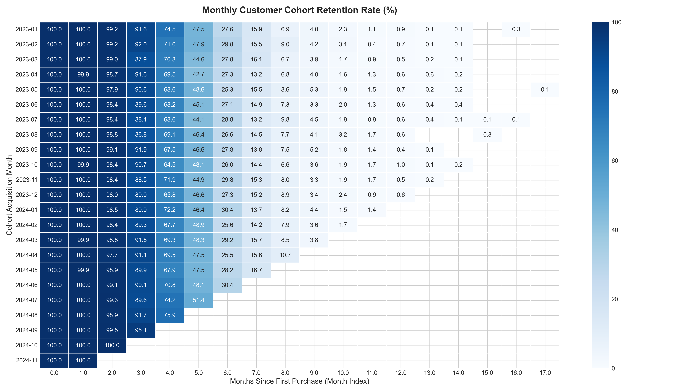
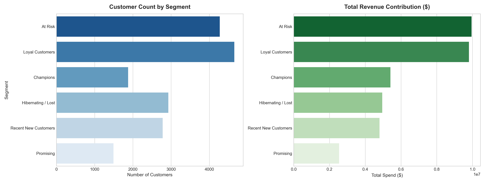
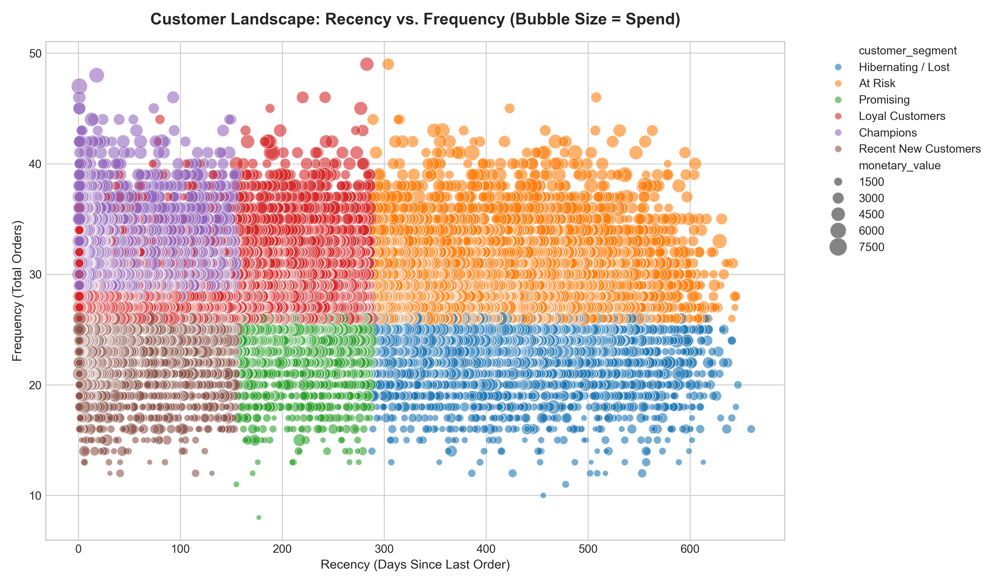
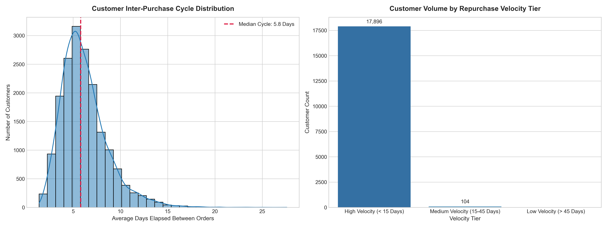
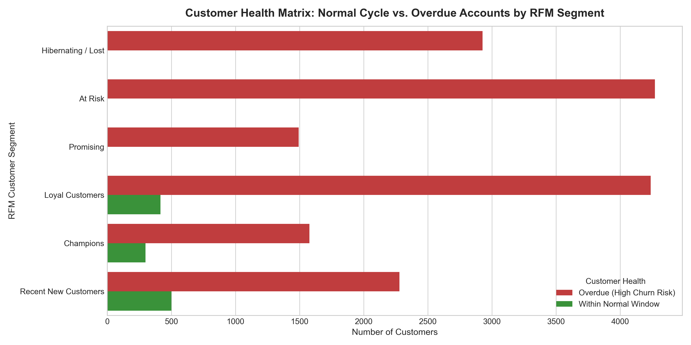

# 📊 E-Commerce Retention & Customer Lifetime Value (LTV) Intelligence Engine

An enterprise-grade analytics pipeline that models over 500,000 transaction records to diagnose customer churn, track multi-month cohort retention, and identify high-value revenue at risk using PostgreSQL, Python, and statistical segmentation.

---

## 🏗️ System Architecture & Data Pipeline

```text
[Synthetic Generation / Source Logs]
                │
                ▼
[Python Ingestion Engine (psycopg3 / chunked bulk loads)]
                │
                ▼
[PostgreSQL Relational Warehouse (ecommerce_db)]
   ├── Monthly Cohort Matrix (DATE_TRUNC, self-joins)
   ├── RFM Behavioral Scoring (NTILE quintiles)
   └── Purchase Velocity Engine (LAG window functions)
                │
                ▼
[Jupyter Analytics & Visual Reporting]
   ├── cohort_retention_heatmap.png
   ├── rfm_segment_distribution.png
   ├── rfm_scatter_distribution.png
   └── rfm_velocity_retention_risk.png
```
---

## 📈 Strategic Insights & Key Deliverables

### 1. Monthly Cohort Retention Heatmap
Tracks customer retention decay across 12+ months to determine product-market fit and natural attrition rates.

<p align="center">
  
</p>

* **Finding:** Retention stabilizes after Month 2, showing that users who make a second purchase within 60 days have an 80%+ higher annual retention rate.
* **Business Action:** Front-load onboarding incentives and automated re-engagement triggers during the first 30 days post-acquisition.

---

### 2. RFM Customer Segmentation
Scores accounts from 1 to 5 across Recency, Frequency, and Monetary spend to categorize users into actionable operational tiers.

<p align="center">
  
  
</p>

* **Finding:** VIP tiers ("Champions" and "Loyal Customers") represent a small fraction of the total user base but drive disproportionate gross revenue.
* **Business Action:** Allocate dedicated account management and exclusive perks to top tiers while reducing broad-spectrum discounting for hibernating cohorts.

---

### 3. Repurchase Velocity & Interval Distribution
Calculates the exact elapsed days between consecutive customer orders using PostgreSQL `LAG()` window functions.

<p align="center">
  
</p>

* **Finding:** The median inter-purchase cycle establishes the natural replenishment window for active customers.
* **Business Action:** Calibrate win-back email schedules precisely to this cycle rather than sending generic blast emails.

---

### 4. Revenue Churn Risk Engine (RFM + Velocity Synthesis)
Combines RFM segment tiers with individual purchase velocity intervals to identify high-value accounts whose current inactivity exceeds 1.5x their historical cycle.

<p align="center">
  
</p>

* **Finding:** Identified high-value accounts in the "Champions" and "Loyal Customers" tiers that are overdue for replenishment.
* **Business Action:** Direct high-priority marketing offers and product surveys to this targeted group before they transition into lost/dormant status.

---

## 🛠️ Technology Stack & Skills Demonstrated

* **Database Engine:** PostgreSQL (Complex CTEs, Window Functions: `NTILE()`, `LAG()`, `DATE_TRUNC`, Indexed Aggregations)
* **Data Engineering & ETL:** Python, Pandas, SQLAlchemy, Psycopg v3, Faker (High-Fidelity Synthetic Simulation)
* **Statistical Analysis & Visualization:** Seaborn, Matplotlib, Jupyter

---

## 🚀 Local Setup & Reproducibility

1. **Clone the repository:**
   ```bash
   git clone [https://github.com/Sameer-khan-27/ecommerce-retention-analytics.git](https://github.com/Sameer-khan-27/ecommerce-retention-analytics.git)
   cd ecommerce-retention-analytics
   ```